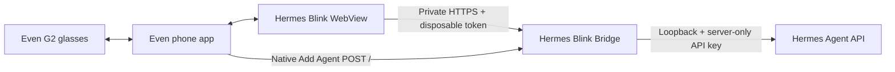
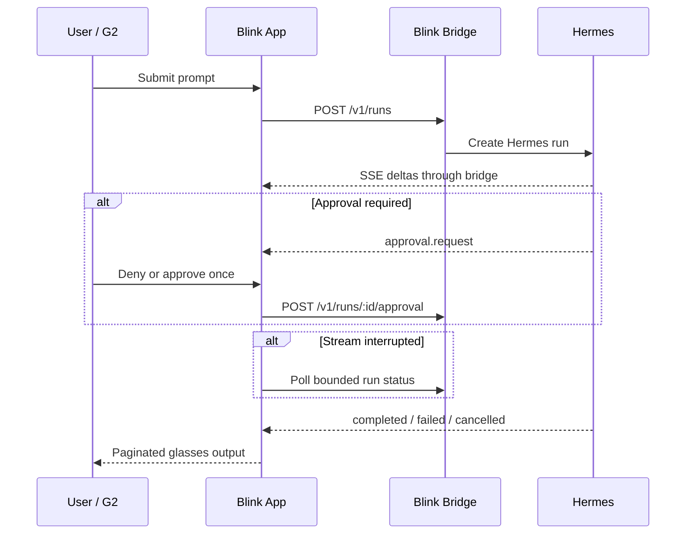

# Hermes Blink App

[](https://github.com/s0xn1ck/hermes-blink-app/actions/workflows/ci.yml)

An unofficial Even Realities G2 client for a user-owned Hermes Agent. It connects only through [Hermes Blink Bridge](https://github.com/s0xn1ck/hermes-blink-bridge), so the broad Hermes API credential never enters the phone or package.

> **Status: alpha.** Tests, builds and security scans pass. Real-device networking, locked-phone behavior and interaction quality still require validation on the exact private G2 package.

Hermes Blink is independent and is not affiliated with or endorsed by Even Realities or Nous Research.

## What it does

- Lists, searches, creates and selects isolated Blink sessions
- Starts Hermes Runs and renders streamed replies
- Reconciles interrupted streams through bounded status polling
- Supports stop, approve-once and deny
- Paginates and throttles output for the G2 display
- Stores the disposable bridge token in WebView session storage
- Provides sanitized diagnostics and browser-only UI preview

## Architecture



The app and native Add Agent share a narrow bridge, not the Hermes master credential.

## Run lifecycle



## Security model

```text
Phone/G2: disposable BLINK_API_TOKEN only
Bridge:   validates narrow routes, methods, bodies and approvals
Hermes:   broad API credential remains on the local host
Network:  private HTTPS ingress; Hermes stays on loopback
```

Never put the Hermes API key, bridge token, private hostname or runtime configuration in `app.json`, source, URLs, logs or `.ehpk` packages.

## Development

Requirements: Node.js 24+.

```bash
npm ci
npm test -- --run
npm run build
```

Browser-only preview:

```bash
npm run dev
# open http://localhost:5173/?preview=1
```

Preview mode replaces the hardware bridge with a no-op renderer. Normal builds still require the Even bridge.

## Packaging

Runtime-configured private package:

```bash
npm run build
npx evenhub pack app.json dist -o hermes-blink-app.ehpk
```

Fixed-origin development package:

```bash
HERMES_BLINK_API_ORIGIN=https://your-private-bridge.example.com npm run pack:dev
```

Generated `.ehpk`, `dist`, environment files and credentials are ignored by Git.

The source manifest intentionally uses an empty network whitelist to test runtime-configured endpoints demonstrated by released BYO-backend apps. Even documentation and observed behavior conflict. Do not claim universal arbitrary-origin support until the exact package passes real-device testing.

## First private test

1. Deploy the bridge on loopback behind private HTTPS.
2. Install the exact Draft/Private/Test `.ehpk`.
3. Enter the bridge origin and newly generated disposable token.
4. Verify sessions and `Reply with exactly G2 READY`.
5. Test streaming, pagination, stop, approve once and deny.
6. Test network interruption, phone lock/unlock and reconnection.

See [PRIVACY.md](PRIVACY.md), [SECURITY.md](SECURITY.md) and the [bridge deployment guide](https://github.com/s0xn1ck/hermes-blink-bridge/blob/main/deployment.md).

## License

MIT
